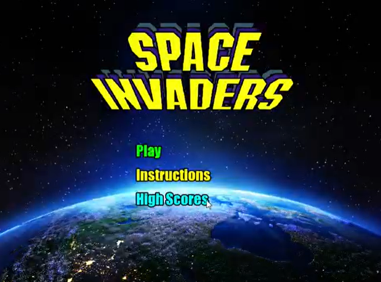
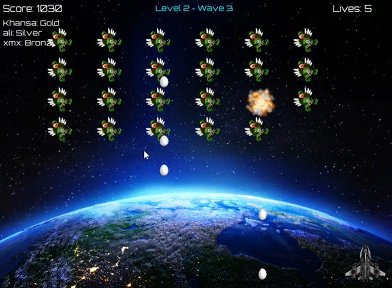
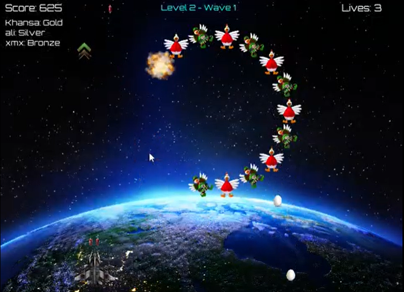
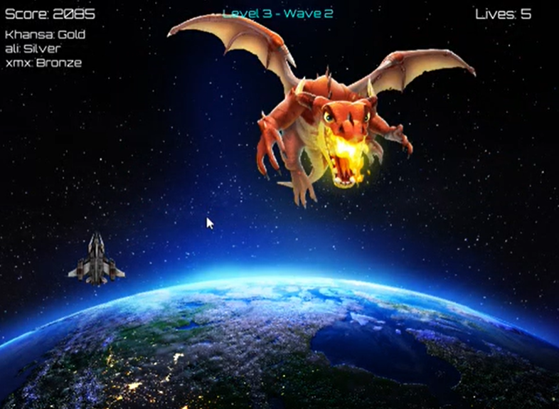
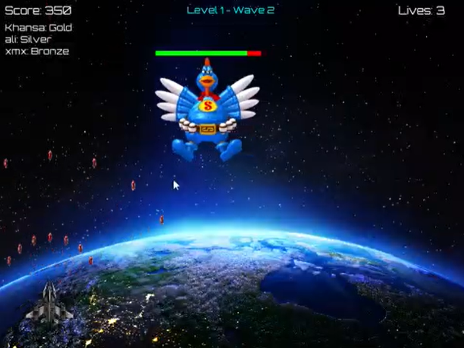
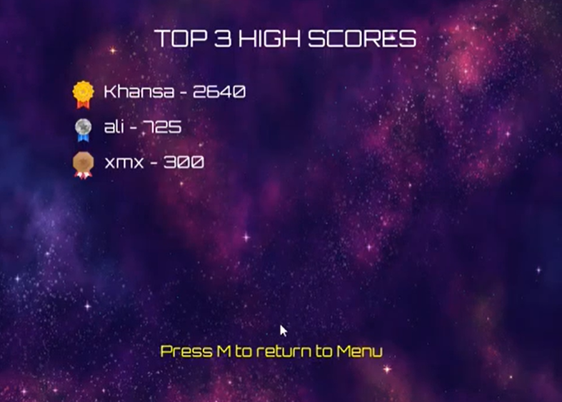
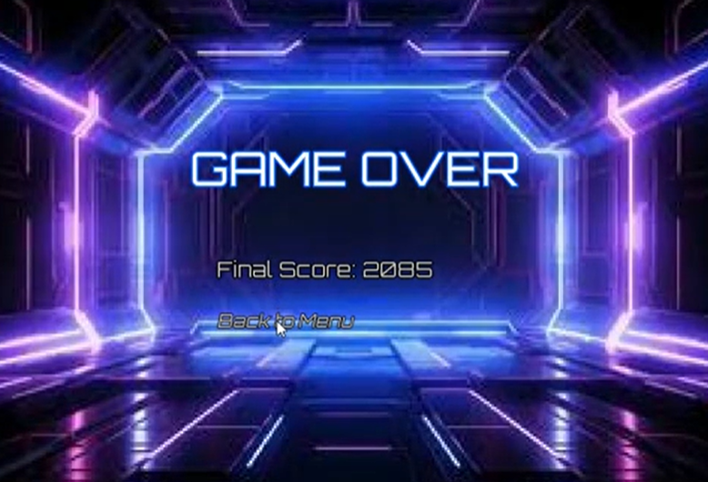
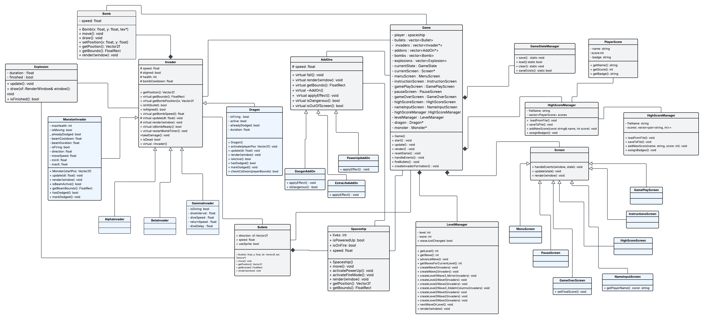

# 🚀 Space Invaders (SFML)

A modern Space Invaders game developed in **C++** using the **SFML** graphics library. This project demonstrates Object-Oriented Programming (OOP) principles, game development concepts, collision detection, file handling, and game state management through a feature-rich arcade shooter.

> 📚 **Course:** Object Oriented Programming
> 👥 **Project Type:** University Project

---

# 📌 Overview

This project recreates the classic Space Invaders game while extending it with multiple enemy types, boss battles, power-ups, level progression, and a persistent high-score system.

The game emphasizes clean software design using inheritance, polymorphism, abstraction, and encapsulation.

---

# ✨ Features

- 🎮 Interactive Main Menu
- 📖 Instructions Screen
- 🚀 Spaceship with Wrap-Around Movement
- 👾 Alpha, Beta & Gamma Invaders
- 🐉 Dragon Boss
- 👹 Monster Boss
- 💥 Bomb & Bullet Collision Detection
- ⚡ Power-Up Mode
- 🔥 Fire Mode
- ❤️ Extra Life Add-on
- ☠️ Danger Add-on
- ⏸ Pause Menu
- 💾 Save & Resume Game
- 🏆 High Score System
- 📈 Three Progressive Levels
- 🎯 Multiple Enemy Formations

---

# 🛠️ Technologies

- C++
- SFML
- Object-Oriented Programming
- File Handling
- Visual Studio

---

# 🧠 OOP Concepts Used

- Inheritance
- Polymorphism
- Encapsulation
- Abstraction
- Composition

---

# 🎮 Gameplay

Players control a spaceship to defeat waves of enemies while avoiding bombs, collecting power-ups, and progressing through increasingly difficult levels.

Enemy formations change with each level, introducing stronger opponents and unique boss encounters.

---

# 📚 Enemy Types

| Enemy | Description |
|--------|-------------|
| Alpha Invader | Bomb every 5 seconds |
| Beta Invader | Bomb every 3 seconds |
| Gamma Invader | Bomb every 2 seconds |
| Monster | Horizontal movement with lightning attacks |
| Dragon | Fires in multiple directions based on player position |

---

# ⚡ Power-Ups

- Power Mode
- Fire Mode
- Extra Life
- Danger Sign

---

# 📷 Screenshots

## Main Menu

---

## Gameplay

---

## Dragon Boss

---

## Monster Boss

---

## Pause Screen

---

## High Scores

---

## Game Over

---

# 🎥 Gameplay Video

A gameplay demonstration is available in:

`videos/gameplay.mp4`

---

# 🏗️ Class Diagram

---

# 🚀 How to Build

1. Open `SpaceInvaders.sln`
2. Select **x64**
3. Build the solution.
4. Run the project.

---

# 📁 Project Structure

- SFML
- Assets
- Source Code
- Screenshots
- Gameplay Video
- UML Class Diagram

---

# 🎓 Learning Outcomes

- Object-Oriented Programming
- Game Development
- Event Handling
- Collision Detection
- Game State Management
- File Handling
- Software Design

